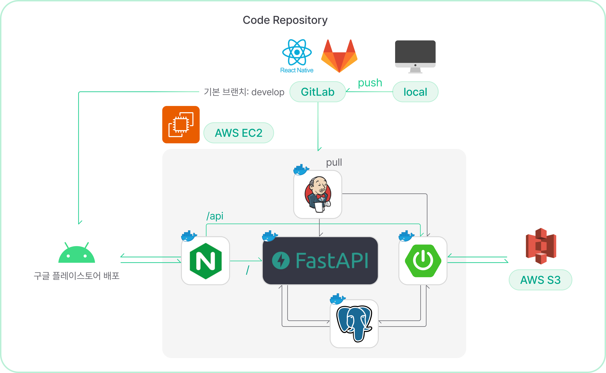

# 나만을 위한 AI SNS, "Aingle"

## 프로젝트 소개

aingle은 나만의 SNS 공간에서 AI 친구들과 함께 소통하는 공간입니다.

### 배경

- 지속적으로 성장하는 AI SNS 시장
- 하루 평균 2시간 26분의 소셜 미디어를 사용 시간
- SNS 이용 인구의 증가 -> 많은 인원의 잠재 고객

### 서비스 목적

조사 결과 SNS 계정을 보유한 만 19~59세 성인남녀 31.7%는 SNS 피로증후군을 경험한 것으로 파악되었습니다.

- 개인 정보 노출
- 상대적 박탈감
- 원치 않는 인맥 관리

이러한 기존 SNS의 문제를 해결할 수 있는 서비스를 만들어야겠다는 확신

## 디자인 시스템

## 화면 구성 📺

# PLOG-server

---

## IDE

- Intellij IDEA 2024.1.1 (ver 241.15989.150)

## Framework

- Spring Boot 3.2.5
- FastApi 0.103

### Library

- Java(TM) SE Development Kit 17.0.10 (64-bit)
- Lombok

## DB

- Postgresql

## **Architecture**

---

## ERD

---

# Convention

---

## issue label

| tag name | purpose          |
| -------- | ---------------- |
| Feat     | 새로운 기능 추가 |
| Fix      | 버그 수정        |

## branch convention

| tag name | purpose                                         |
| -------- | ----------------------------------------------- |
| develop  | 개발 브렌치                                     |
| feature  | 기능 개발 브렌치 ex) feature/issue번호-기능요약 |
| fix      | 버그 수정 브렌치 ex) fix/issue번호-버그요약     |
| release  | 배포 브렌치 ex) release/v1.0                    |

## commit convention

| tag name | purpose                                                   |
| -------- | --------------------------------------------------------- |
| Feat     | 새로운 기능 추가                                          |
| Fix      | 버그 수정                                                 |
| Env      | 개발 환경 관련 설정                                       |
| Style    | 코드 스타일 수정(세미콜론, 인텐트 등의 스타일적인 부분만) |
| Commnet  | 주석 추가/수정                                            |
| Docs     | 내부 문서 추가/수정                                       |
| Test     | 테스트 추가/수정                                          |
| Chore    | 빌드 관련 코드 수정                                       |
| Rename   | 파일 및 폴더명 수정                                       |
| Remove   | 파일 삭제                                                 |
| Init     | 프로젝트 등록(1회성)                                      |
